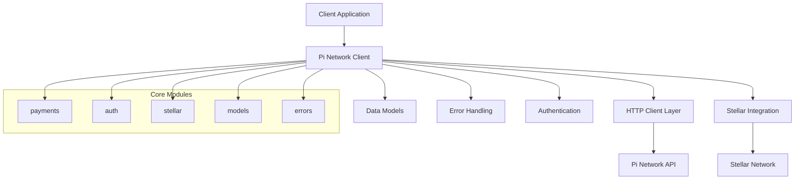

# Pi Network Rust SDK Design Document

## Overview

The Pi Network Rust SDK (pi-rust) is designed as a comprehensive, type-safe, and async-first client library for interacting with Pi Network APIs and Stellar blockchain operations. The SDK follows Rust best practices with a focus on ergonomics, performance, and reliability.

The design emphasizes:
- **Type Safety**: Leveraging Rust's type system to prevent runtime errors
- **Async-First**: Built on tokio for high-performance concurrent operations  
- **Error Handling**: Comprehensive error types using `thiserror` for clear error propagation
- **Modularity**: Clean separation of concerns with distinct modules for different functionality
- **Testing**: Extensive test coverage with mock servers and integration tests
- **Documentation**: Rich rustdoc documentation with examples

## Architecture

### High-Level Architecture



### Module Structure

```
pi-rust/
├── src/
│   ├── lib.rs              # Main library entry point
│   ├── client.rs           # Core PiNetworkClient
│   ├── config.rs           # Configuration and builder
│   ├── models/             # Data models module
│   │   ├── mod.rs
│   │   ├── auth.rs         # Authentication models
│   │   ├── payment.rs      # Payment-related models
│   │   ├── stellar.rs      # Stellar-specific models
│   │   └── common.rs       # Shared models
│   ├── payments/           # Payment operations
│   │   ├── mod.rs
│   │   └── client.rs       # Payment client implementation
│   ├── auth/               # Authentication operations
│   │   ├── mod.rs
│   │   └── client.rs       # Auth client implementation
│   ├── stellar/            # Stellar blockchain operations
│   │   ├── mod.rs
│   │   ├── client.rs       # Stellar client implementation
│   │   └── networks.rs     # Network configurations
│   ├── errors.rs           # Error types and handling
│   └── utils.rs            # Utility functions
├── tests/                  # Integration tests
├── examples/               # Usage examples
└── docs/                   # Additional documentation
```

## Components and Interfaces

### Core Client (`client.rs`)

The main `PiNetworkClient` serves as the entry point and orchestrates all operations:

```rust
pub struct PiNetworkClient {
    http_client: reqwest::Client,
    config: ClientConfig,
    base_url: Url,
}

impl PiNetworkClient {
    pub fn new(api_key: String) -> Result<Self, PiError>;
    pub fn with_config(config: ClientConfig) -> Result<Self, PiError>;
    
    // Payment operations
    pub async fn create_payment(&self, payment: CreatePaymentRequest) -> Result<Payment, PiError>;
    pub async fn get_payment(&self, identifier: &str) -> Result<Payment, PiError>;
    pub async fn approve_payment(&self, identifier: &str) -> Result<Payment, PiError>;
    pub async fn cancel_payment(&self, identifier: &str) -> Result<Payment, PiError>;
    pub async fn complete_payment(&self, identifier: &str, tx_id: &str) -> Result<Payment, PiError>;
    pub async fn get_incomplete_payments(&self) -> Result<Vec<Payment>, PiError>;
    
    // Auth operations
    pub async fn get_user_profile(&self, access_token: &str) -> Result<UserProfile, PiError>;
    
    // Stellar operations
    pub async fn get_account_balance(&self, network: Network, account: &str) -> Result<f64, PiError>;
    pub async fn send_native_assets(&self, params: SendAssetsParams) -> Result<TransactionResponse, PiError>;
}
```

### Configuration (`config.rs`)

Flexible configuration system with builder pattern:

```rust
#[derive(Debug, Clone)]
pub struct ClientConfig {
    pub api_key: String,
    pub base_url: Url,
    pub timeout: Duration,
    pub retry_config: RetryConfig,
    pub user_agent: String,
}

#[derive(Debug, Clone)]
pub struct RetryConfig {
    pub max_retries: u32,
    pub initial_delay: Duration,
    pub max_delay: Duration,
    pub backoff_factor: f64,
}

impl ClientConfig {
    pub fn builder(api_key: String) -> ClientConfigBuilder;
}

pub struct ClientConfigBuilder {
    config: ClientConfig,
}

impl ClientConfigBuilder {
    pub fn base_url(mut self, url: Url) -> Self;
    pub fn timeout(mut self, timeout: Duration) -> Self;
    pub fn retry_config(mut self, retry_config: RetryConfig) -> Self;
    pub fn build(self) -> ClientConfig;
}
```

### Data Models (`models/`)

#### Authentication Models (`models/auth.rs`)

```rust
#[derive(Debug, Clone, Serialize, Deserialize)]
pub struct UserProfile {
    pub access_token: String,
    pub user: User,
}

#[derive(Debug, Clone, Serialize, Deserialize)]
pub struct User {
    pub uid: String,
    pub username: String,
    pub credentials: Credentials,
}

#[derive(Debug, Clone, Serialize, Deserialize)]
pub struct Credentials {
    pub scopes: Vec<String>,
    pub valid_until: ValidTime,
}

#[derive(Debug, Clone, Serialize, Deserialize)]
pub struct ValidTime {
    pub timestamp: i64,
    pub iso8601: DateTime<Utc>,
}
```

#### Payment Models (`models/payment.rs`)

```rust
#[derive(Debug, Clone, Serialize, Deserialize)]
pub struct Payment {
    pub identifier: String,
    pub user_uid: String,
    pub amount: f64,
    pub memo: Option<String>,
    pub metadata: Option<Metadata>,
    pub from_address: Option<String>,
    pub to_address: Option<String>,
    pub created_at: DateTime<Utc>,
    pub direction: String,
    pub network: String,
    pub status: PaymentStatus,
    pub transaction: Option<TransactionStatus>,
}

#[derive(Debug, Clone, Serialize, Deserialize)]
pub struct PaymentStatus {
    pub developer_approved: bool,
    pub transaction_verified: bool,
    pub developer_completed: bool,
    pub cancelled: bool,
    pub user_cancelled: bool,
}

#[derive(Debug, Clone, Serialize, Deserialize)]
pub struct CreatePaymentRequest {
    pub payment: PaymentArgs,
}

#[derive(Debug, Clone, Serialize, Deserialize)]
pub struct PaymentArgs {
    pub amount: f64,
    pub memo: Option<String>,
    pub metadata: Option<serde_json::Value>,
    pub uid: String,
}
```

#### Stellar Models (`models/stellar.rs`)

```rust
#[derive(Debug, Clone)]
pub enum Network {
    PiMainnet,
    PiTestnet,
    StellarTestnet,
}

#[derive(Debug, Clone)]
pub struct SendAssetsParams {
    pub network: Network,
    pub source_secret: String,
    pub destination: String,
    pub amount: f64,
    pub memo: Option<String>,
    pub fee: Option<u32>,
}

#[derive(Debug, Clone, Serialize, Deserialize)]
pub struct TransactionResponse {
    pub hash: String,
    pub ledger: u32,
    pub envelope_xdr: String,
    pub result_xdr: String,
    pub result_meta_xdr: String,
}
```

### Error Handling (`errors.rs`)

Comprehensive error handling using `thiserror`:

```rust
#[derive(Debug, thiserror::Error)]
pub enum PiError {
    #[error("HTTP request failed: {0}")]
    Http(#[from] reqwest::Error),
    
    #[error("JSON serialization/deserialization failed: {0}")]
    Json(#[from] serde_json::Error),
    
    #[error("Pi Network API error: {error_name} - {error_message}")]
    PiNetwork {
        error_name: String,
        error_message: String,
        payment: Option<Payment>,
    },
    
    #[error("Authentication failed: {0}")]
    Authentication(String),
    
    #[error("Invalid configuration: {0}")]
    Configuration(String),
    
    #[error("Stellar operation failed: {0}")]
    Stellar(String),
    
    #[error("Insufficient balance: available {available}, required {required}")]
    InsufficientBalance { available: f64, required: f64 },
    
    #[error("Invalid network: {0}")]
    InvalidNetwork(String),
    
    #[error("Timeout occurred after {duration:?}")]
    Timeout { duration: Duration },
}

pub type Result<T> = std::result::Result<T, PiError>;
```

### Payment Operations (`payments/client.rs`)

Dedicated payment client with comprehensive operations:

```rust
pub struct PaymentClient {
    http_client: reqwest::Client,
    base_url: Url,
    api_key: String,
}

impl PaymentClient {
    pub async fn create(&self, request: CreatePaymentRequest) -> Result<Payment>;
    pub async fn get(&self, identifier: &str) -> Result<Payment>;
    pub async fn approve(&self, identifier: &str) -> Result<Payment>;
    pub async fn cancel(&self, identifier: &str) -> Result<Payment>;
    pub async fn complete(&self, identifier: &str, tx_id: &str) -> Result<Payment>;
    pub async fn get_incomplete(&self) -> Result<Vec<Payment>>;
    
    async fn make_request<T>(&self, request: RequestBuilder) -> Result<T>
    where
        T: DeserializeOwned;
}
```

### Stellar Integration (`stellar/client.rs`)

Stellar blockchain operations with network abstraction:

```rust
pub struct StellarClient {
    http_client: reqwest::Client,
}

impl StellarClient {
    pub async fn get_account_balance(&self, network: Network, account: &str) -> Result<f64>;
    pub async fn send_native_assets(&self, params: SendAssetsParams) -> Result<TransactionResponse>;
    
    fn get_server_url(&self, network: &Network) -> &'static str;
    async fn build_transaction(&self, params: &SendAssetsParams) -> Result<stellar_sdk::Transaction>;
}
```

## Testing Strategy

### Unit Tests

Each module includes comprehensive unit tests:

- **Mock HTTP Responses**: Using `wiremock` for API response simulation
- **Error Scenarios**: Testing all error conditions and edge cases
- **Data Validation**: Ensuring proper serialization/deserialization
- **Configuration**: Testing builder patterns and validation

### Integration Tests

End-to-end testing with real API interactions:

- **Payment Workflows**: Complete payment lifecycle testing
- **Authentication**: User profile retrieval and token validation
- **Stellar Operations**: Transaction creation and submission
- **Error Handling**: Network failures and API errors

### Test Structure

```rust
// Unit test example
#[cfg(test)]
mod tests {
    use super::*;
    use wiremock::{MockServer, Mock, ResponseTemplate};
    use wiremock::matchers::{method, path, header};

    #[tokio::test]
    async fn test_create_payment_success() {
        let mock_server = MockServer::start().await;
        
        Mock::given(method("POST"))
            .and(path("/payments"))
            .and(header("authorization", "Key test-api-key"))
            .respond_with(ResponseTemplate::new(200)
                .set_body_json(&expected_payment))
            .mount(&mock_server)
            .await;

        let client = PiNetworkClient::new("test-api-key".to_string()).unwrap();
        let result = client.create_payment(create_request).await;
        
        assert!(result.is_ok());
        // Additional assertions...
    }
}
```

### Benchmarking

Performance benchmarks using `criterion`:

```rust
use criterion::{black_box, criterion_group, criterion_main, Criterion};

fn benchmark_payment_creation(c: &mut Criterion) {
    c.bench_function("create_payment", |b| {
        b.iter(|| {
            // Benchmark payment creation
        })
    });
}

criterion_group!(benches, benchmark_payment_creation);
criterion_main!(benches);
```

## Dependencies

### Core Dependencies

```toml
[dependencies]
tokio = { version = "1.0", features = ["full"] }
reqwest = { version = "0.11", features = ["json", "rustls-tls"] }
serde = { version = "1.0", features = ["derive"] }
serde_json = "1.0"
thiserror = "1.0"
url = "2.0"
chrono = { version = "0.4", features = ["serde"] }
uuid = { version = "1.0", features = ["v4", "serde"] }

# Stellar SDK (to be evaluated/implemented)
stellar-sdk = "0.1"  # Placeholder - may need custom implementation

[dev-dependencies]
wiremock = "0.5"
criterion = "0.5"
tokio-test = "0.4"
```

### Optional Features

```toml
[features]
default = ["rustls-tls"]
rustls-tls = ["reqwest/rustls-tls"]
native-tls = ["reqwest/native-tls"]
tracing = ["dep:tracing"]
```

## Security Considerations

### API Key Management

- API keys stored securely in configuration
- No logging of sensitive data
- Clear documentation on secure storage practices

### Network Security

- HTTPS-only communication
- Certificate validation
- Request/response validation

### Data Handling

- Sensitive data cleared from memory when possible
- No caching of authentication tokens
- Proper error messages without sensitive data exposure

## Performance Optimizations

### Connection Pooling

- Reuse HTTP connections via `reqwest::Client`
- Configurable connection limits
- Proper connection lifecycle management

### Async Operations

- Non-blocking I/O throughout
- Efficient task scheduling
- Minimal memory allocations

### Serialization

- Efficient JSON processing with `serde_json`
- Zero-copy deserialization where possible
- Streaming for large responses

## Documentation Strategy

### API Documentation

- Comprehensive rustdoc comments
- Usage examples for all public APIs
- Error handling examples
- Network-specific guidance

### Guides and Tutorials

- Getting started guide
- Payment workflow examples
- Stellar integration examples
- Error handling best practices

### Contributing Documentation

- Development setup instructions
- Testing guidelines
- Code style requirements
- PR submission process